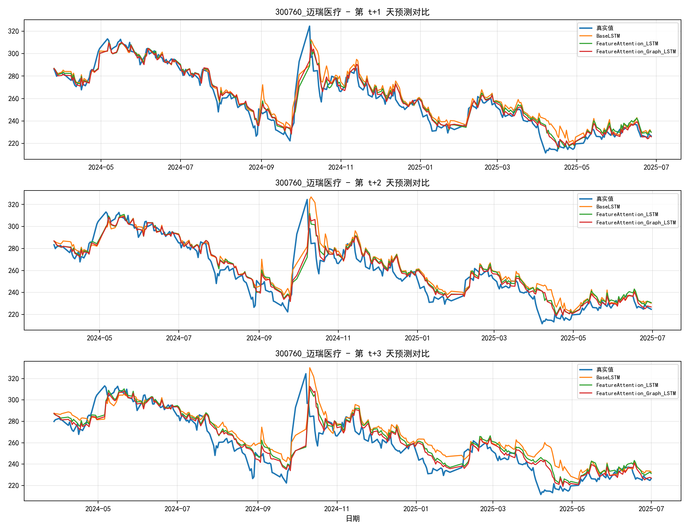
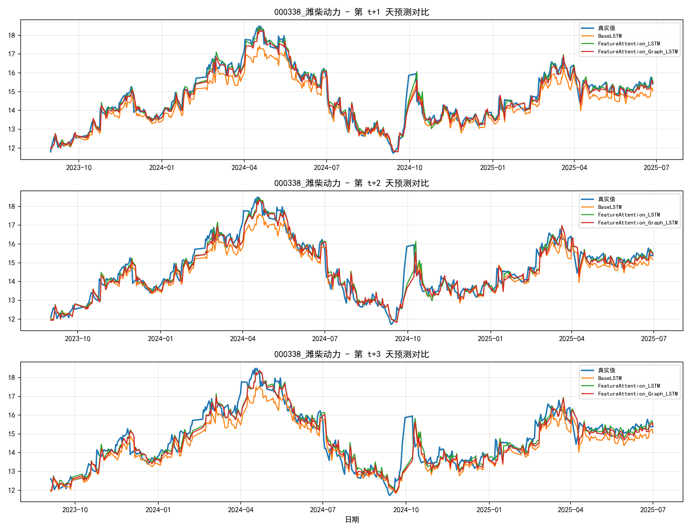
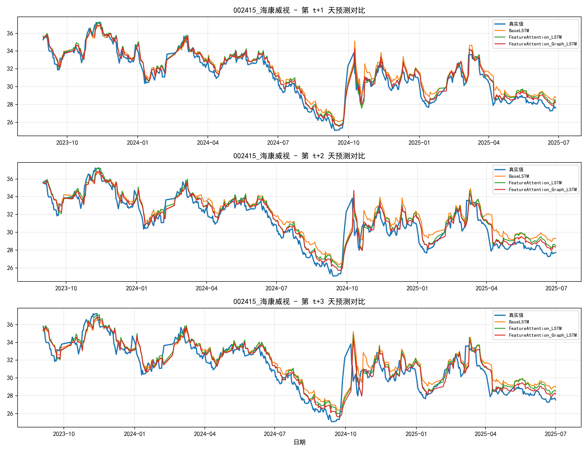

# LSTM多模型股票三步预测实验结果

## 1. 模型是怎么搭建的

### 1.1 任务定义

- 研究对象：A股多只股票，每只股票单独建模、单独训练、单独评估。
- 输入窗口：过去90个交易日特征序列（lookback=90）。
- 输出目标：未来3天收盘价，分别是 t+1、t+2、t+3。
- 评价指标：R2、MAE（同时记录MSE、RMSE）。

### 1.2 整体流程

1. 数据获取与清洗：统一字段、去空值、按时间排序。
2. 特征工程：价格与技术指标组合成多维输入特征。
3. 滑窗构样本：把连续时间序列转成监督学习样本。
4. 训练/验证/测试划分：按时间顺序划分，避免未来信息泄露。
5. 训练策略：AdamW + 学习率调度 + 早停机制。
6. 输出预测：同时输出3个步长预测值，并做逐步评估。

### 1.3 三个核心模型结构

#### A. BaseLSTM（基线）

输入特征序列 -> LSTM编码 -> 全连接层 -> 3步预测输出。

作用：提供最基础的时序建模能力，用来对比增强模块是否有效。

#### B. FeatureAttention_LSTM（注意力增强）

输入特征序列 -> 特征注意力层 -> LSTM编码 -> 全连接层 -> 3步预测输出。

作用：让模型自动学习“当前时段哪些特征更重要”，强化关键因子。

#### C. FeatureAttention_Graph_LSTM（图结构增强）

输入特征序列 -> 特征注意力层 -> 图特征关系建模层 -> LSTM编码 -> 全连接层 -> 3步预测输出。

作用：在注意力基础上，再显式建模“特征与特征之间的关联结构”，提升复杂市场条件下的表达能力。

## 2. 25股全量实验总体结果

按 overall_R2 的平均结果：

| 模型                        | mean_overall_R2 | mean_overall_MAE | 相对Base提升 |
| --------------------------- | --------------: | ---------------: | -----------: |
| FeatureAttention_Graph_LSTM |          0.8052 |           2.7360 |      +0.0622 |
| FeatureAttention_LSTM       |          0.7971 |           2.7752 |      +0.0541 |
| BaseLSTM                    |          0.7430 |           3.0892 |            0 |

- 只加注意力（FeatureAttention）就能在25股平均意义上稳定提升R2。
- 在注意力上再加图结构（Graph）后，整体R2和MAE进一步改善。
- 这说明你的创新点不是“单股偶然有效”，而是“在全池股票上有统计意义的提升趋势”。

## 3. 三只代表股票可视化

### 3.1 300760 迈瑞医疗

- R2：Base 0.7816 -> FeatureAttention 0.8624 -> Graph 0.8835
- 观察重点：三步预测中，Graph曲线整体更贴近真实值，尤其在波动区间更稳定。

### 3.2 000338 潍柴动力

- R2：Base 0.8491 -> FeatureAttention 0.9129 -> Graph 0.9117
- 观察重点：注意力模块显著提升拟合；Graph与Attention接近，表明该股主要收益来自“特征重加权”。

### 3.3 002415 海康威视

- R2：Base 0.8125 -> FeatureAttention 0.8722 -> Graph 0.8897
- 观察重点：Graph在三步预测上都有增益，体现“特征关系建模”带来的持续改进。

## 4. 结果文件索引

- 全局汇总：summary_25stocks_full_with_ablation.csv
- 全部明细：all_25stocks_full_results.csv
- 三股图清单：selected_stock_plots/selected_stock_plot_manifest.csv
- 三股指标明细：selected_stock_plots/selected_stock_model_metrics.csv
